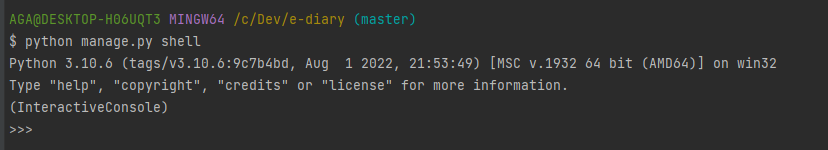
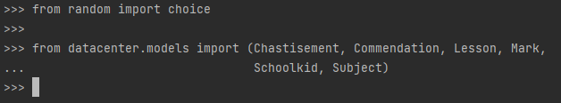
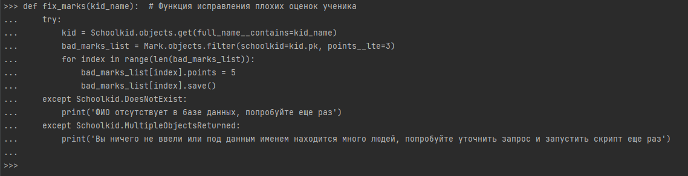
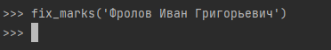
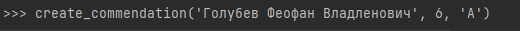

# Скрипты для корректировки электронного дневника школы

Скрипт состоит из трёх функции:

- `fix_marks(kid_name)` Функция исправления плохих оценок ученика
- `remove_chastisements(kid_name)` Функция удаления всех замечаний ученика
- `create_commendation(kid_name, year_of_study, group_letter)` Функция создания похвалы для ученика по случайному предмету

Можно использовать как все вместе так и поотдельности.

Перед приминением следует развернуть сайт у себя:

https://github.com/devmanorg/e-diary

Поместить файл scripts.py из текущего репозитория в рядом с manage.py

### Инструкция по использованию скриптов путем копирования

В папке с файлом manage.py, через терминал выполнить команду:

`python manage.py shell`

Пример успешного запуска интерпретатора python:

Импортируем модули командами из файла:

`from random import choice`  
`from datacenter.models import (Chastisement, Commendation, Lesson, Mark,
                               Schoolkid, Subject)`

Прописываем функции в консоль (выбираем конкретную функцию от потребности или используем все функции), нажимаем два раза Enter:

Вызываем функцию(и) с нужными нам параметрами(ФИО, Можно указать Фамилию и Имя, но есть вероятность ошибки из-зп наличия однофамильца 
, поэтому лкчше использовать боле точный запрос):

`fix_marks('Фролов Иван Григорьевич')`

Функция create_commendation принимает три аргумента: ФИО, год класса, литер класа(кирилицей)

`create_commendation('Голубев Феофан Владленович', 6, 'A')`

### Инструкция по использованию скриптов путем импорта

В папке с файлом manage.py, через терминал выполнить команду:

`python manage.py shell`

В консоли импортировать скрипты:

`from scripts import *`

Вызываем функцию(и) с нужными нам параметрами:

`create_commendation('Фролов Иван Григорьевич')`